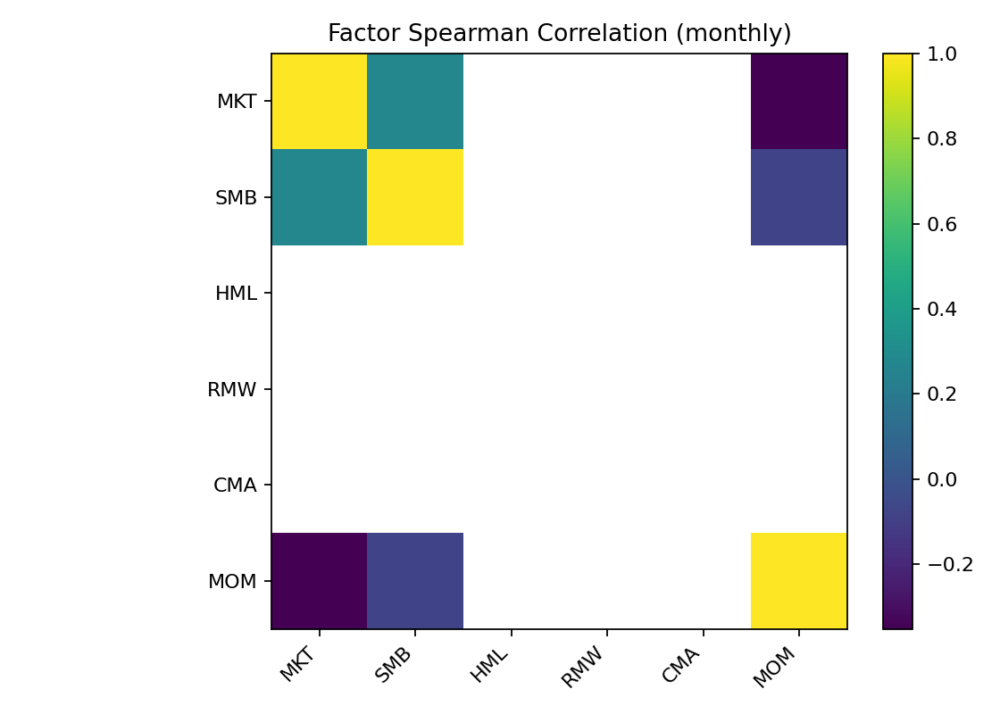

# European Equity Universe

<!-- AUTO-SUMMARY:START -->

_Last updated: **2025-10-31 22:16**_

## Cleaning Summary

- Input returns file: `Investment_universe\europe_returns.csv`
- Input prices file:  `Investment_universe\europe_prices.csv`
- Output directory:   `Investment_universe`

- Tickers in: **126**  → Dropped: **18**  → Kept: **108**

**Auto-rule hit counts:**
- `kurtosis>=50`: **14**
- `abs(skew)>=10`: **3**
- `max_drawdown<=-0.95`: **8**
- `outliers_gt6sigma>=100`: **0**

Key outputs:
- `Investment_universe\europe_returns_cleaned.csv`
- `Investment_universe\europe_prices_cleaned.csv`
- `Investment_universe\europe_dropped_tickers.csv`
- `Investment_universe\europe_kept_tickers.csv`

## Econometric Assumptions

- Tested tickers: **106/106**
- Stationarity (ADF≤α & KPSS≥α): **106** passed
- Ljung–Box (lags [5, 10, 20], α=0.05): **18** passed at all lags
- ARCH LM (lag 5, α=0.05): **0** passed (note: ARCH is expected for returns)

Parameters:
- min_obs = `250`, max_missing = `0.2`
- KPSS reg = `c`

Strongest autocorrelation offenders (lowest LB p)

| Ticker | min LB p |
|---|---:|
| CSN.L | 1.05e-32 |
| SSIT.L | 1.06e-30 |
| ESP.L | 3.55e-21 |
| PCTN.L | 8.51e-18 |
| N91.L | 1.87e-17 |
| LGEN.L | 4.31e-17 |
| SREI.L | 7.19e-17 |
| ALLFG.AS | 3.11e-14 |
| LI.PA | 5.42e-14 |
| SRE.L | 4.33e-13 |

Strongest ARCH offenders (lowest ARCH p)

| Ticker | ARCH p |
|---|---:|
| THRL.L | 2.77e-246 |
| PCTN.L | 2.03e-215 |
| UTG.L | 7.21e-205 |
| N91.L | 8.49e-163 |
| SRE.L | 1.18e-150 |
| ESP.L | 3.73e-145 |
| LGEN.L | 1.05e-144 |
| ICG.L | 1.17e-140 |
| HSX.L | 3.76e-131 |
| LMP.L | 1.9e-127 |

## Hypothesis Testing Summary

| test | estimate | se | tstat | N | note |
|---|---|---|---|---|---|
| Zero-mean across assets (daily) | nan | nan | -0.0208089 | 106 | avg HAC t-stat across assets, lags=5 |
| Momentum L–S (12m, skip1m), monthly | 0.00272986 | 0.00232783 | 1.1727 | 142 | equal-weight deciles; EU financials |
| Fama–MacBeth daily alpha | -1.11e+10 | 4.04e+10 | -0.274706 | 3231 | HAC lags=10 |
| Fama–MacBeth daily beta_mom20d | 1.96e+10 | 3.1e+11 | 0.0634879 | 3231 | HAC lags=10 |
| Fama–MacBeth daily beta_vol20d | -3.18e+12 | 3.38e+12 | -0.938927 | 3231 | HAC lags=10 |
| Spearman IC (mom20d → next-day) | -5.36e+11 | 1.27e+12 | -0.423129 | 3229 | daily IC; HAC lags=10 |

_Source: `reports/hypothesis_tests_summary.csv`_

<!-- AUTO-SUMMARY:END -->

## Factor Regressions (latest)

| ticker   |    adj_R2 |        alpha |   alpha_t |   beta_MKT |    beta_SMB |    beta_MOM |
|:---------|----------:|-------------:|----------:|-----------:|------------:|------------:|
| SREN.SW  | 0.0666583 | -0.00124605  | -1.48019  | -0.0219066 | -0.0618698  |  0.0658892  |
| PHNX.L   | 0.06632   | -0.000521851 | -0.399382 | -0.0148078 | -0.0499546  |  0.0814095  |
| III.L    | 0.0544167 |  0.000731468 |  0.476776 | -0.0279191 | -0.0875269  |  0.0554888  |
| SREI.L   | 0.052225  |  0.000785396 |  0.517441 | -0.106549  | -0.0865003  |  0.0131836  |
| PRU.L    | 0.0395036 | -0.00387735  | -2.30849  |  0.0699354 | -0.142791   |  0.0703631  |
| PHP.L    | 0.0390719 |  0.0020692   |  2.47579  | -0.07645   |  0.0448633  | -0.00570443 |
| BEZ.L    | 0.0380176 |  0.00115937  |  1.11728  | -0.0351427 |  0.00179631 |  0.0533237  |
| BNP.PA   | 0.0375804 | -0.00461263  | -2.43999  |  0.0904011 |  0.0326183  |  0.0868247  |
| ASHM.L   | 0.0373793 | -0.00175707  | -1.22222  |  0.0252733 | -0.069679   |  0.0871887  |
| ESP.L    | 0.034839  |  0.00088086  |  1.07256  | -0.0196821 | -0.0768454  |  0.0131028  |

**Factor correlation (monthly):**

